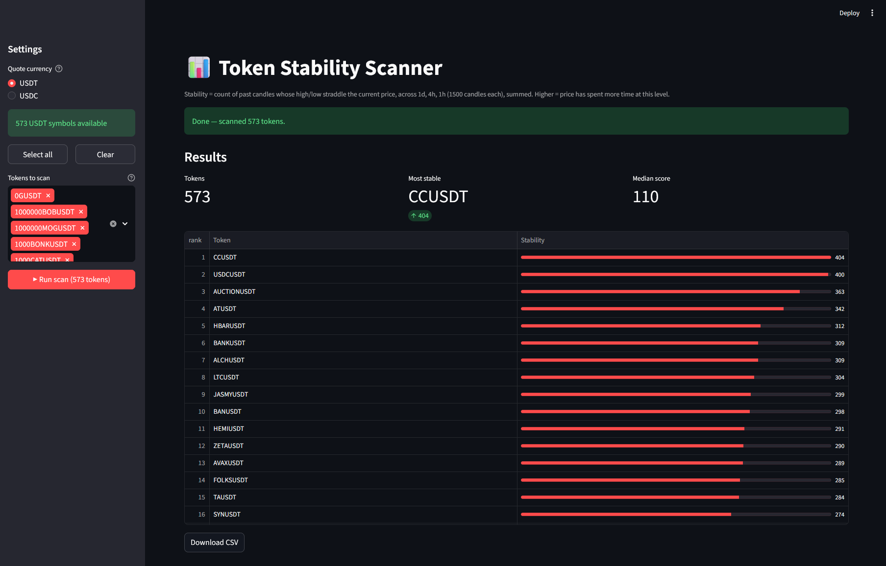
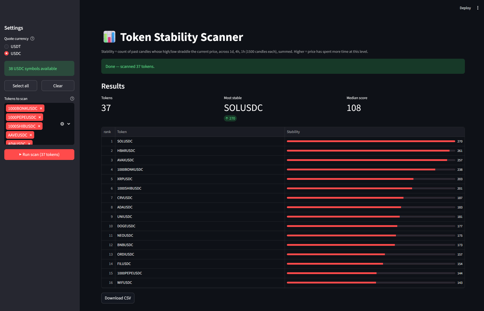

# 📊 Token Stability Scanner

Find the crypto perpetuals whose price has spent the **most time at its
current level** — on Binance USDⓂ Futures.

For every token the scanner pulls the last **1500 candles on the 1h, 4h
and 1d** timeframes and counts how many of those candles had the
token's *current* price between their high and low. The three counts are
summed into a single **stability score**. The higher the score, the
longer price has lingered around where it trades today.

Two ways to run it: a clean **Streamlit dashboard** or a plain
**console** script.

---

## ✨ Features

- **Live token universe** — pulls every tradable USDⓂ Futures symbol
  straight from the exchange, filtered by **USDT** or **USDC**.
- **Pick exactly what you scan** — multiselect with *Select all* /
  *Clear*, so you never waste API calls on tokens you don't care about.
- **Ranked, readable results** — sorted highest-first with an inline
  stability bar, summary metrics and one-click **CSV export**.
- **Live progress** — per-token progress bar while the scan runs.
- **One cross-platform launcher** — a single script detects your OS
  (Windows / macOS / Linux), installs dependencies, opens the dashboard
  in your browser, and a matching stopper shuts everything down.
- **Console mode** — the original behaviour is preserved for scripting.

---

## 🖼️ Screenshots

**USDT scan — ranked results with stability bars**



**USDC scan — switch quote currency in one click**



---

## 🚀 Quick start

### 1. Get the code

```bash
git clone https://github.com/AlexBraguta/stability.git
cd stability
```

### 2. Add your Binance API keys

Copy the template and fill in your keys:

```bash
cp .env.example .env
```

```dotenv
BINANCE_API_KEY=your_api_key_here
BINANCE_API_SECRET=your_api_secret_here
```

> The scanner reads only public market data (klines, ticker,
> exchange info), so it runs even with placeholder keys. Real keys
> simply raise your rate limits.

### 3. Launch the dashboard

| OS | Start | Stop |
|----|-------|------|
| **Windows** | double-click `launch.bat` | double-click `stop.bat` |
| **macOS / Linux** | `./launch.sh` | `./stop.sh` |
| **Any OS** | `python launch.py` | `python stop.py` |

`launch.py` installs the dependencies, starts the server and opens a
browser tab automatically. When you're done, run the stopper — it
cleanly kills the server (no orphan processes).

On macOS/Linux, make the wrappers executable once:

```bash
chmod +x launch.sh stop.sh
```

---

## 🖥️ Console mode

Prefer plain output? Scan the built-in token list and print a sorted
table:

```bash
python main.py
```

---

## 🧠 How the stability score works

For a token at current price `P`:

```
score =  (# of last 1500 1d candles where low < P < high)
       + (# of last 1500 4h candles where low < P < high)
       + (# of last 1500 1h candles where low < P < high)
```

A high score means price keeps returning to (or never left) this
region — a sign of a strong, well-tested level. A low score means the
current price is unusual relative to recent history.

---

## 📁 Project structure

```
stability/
├── app.py            # Streamlit dashboard
├── main.py           # Console entry point + built-in token list
├── stability.py      # Core logic (shared by both entry points)
├── config.py         # Loads API keys from .env
├── launch.py         # Cross-platform launcher (OS-aware)
├── stop.py           # Cross-platform stopper
├── launch.bat/.sh    # Double-click / shell wrappers
├── stop.bat/.sh      # Double-click / shell wrappers
├── requirements.txt
├── .env.example
└── results/          # Historical console-run dumps
```

---

## ⚙️ Requirements

- **Python 3.9+**
- Packages (installed automatically by the launcher):
  `streamlit`, `pandas`, `numpy`, `binance-futures-connector`,
  `python-dotenv`

---

## ⚠️ Notes & limits

- Each token costs **4 API calls** (3 × 1500 candles + 1 ticker).
  Scanning the full ~570-symbol USDT universe is slow and rate-limit
  sensitive — pick a subset in the dashboard for quick runs.
- Market is **USDⓂ Futures only** (perpetuals), not spot.
- `.env` and the runtime PID file are git-ignored — your keys never
  leave your machine.

---

## ⚠️ Disclaimer

**This project is for informational and educational analysis only. It
is not trading or financial advice, not an investment recommendation,
and not a solicitation to buy or sell any asset.** The stability score
is a statistical observation of past price data and says nothing about
future performance. Markets are risky and you can lose money. You are
solely responsible for any decisions you make — always do your own
research. The software is provided "as is", with no warranty of any
kind.

---

## 📄 License

Released under the [MIT License](LICENSE) — free to use, copy, modify
and distribute.
